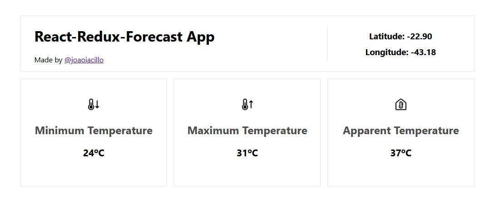

# React-Redux-Forecast App

A simple forecast app for the sake of studying Redux in React. It also uses the
Geolocation API from the browser to obtain the user current coordinates.

# Usage

Install git, node, npm packages from their website and then clone this
repository using:

```bash
$ git clone https://github.com/joaoiacillo/react-redux-forecast
$ cd react-redux-forecast
```

After the repository clonage, install the dependencies using:

```bash
$ npm install
```

This operation may take a while, but once it's finished, you can start the
development server by using:

```bash
$ npm start
```

On the terminal you may see React log messages (a lot of them), but the
one we're looking for is the `Local` or `On Your Network` URL:

```
You can now view react-redux-forecast in the browser.

  Local:            http://localhost:3000
  On Your Network:  http://172.31.144.216:3000
```

You can type any of these URLs in your browser and the website should be
rendered.

# Screenshot



